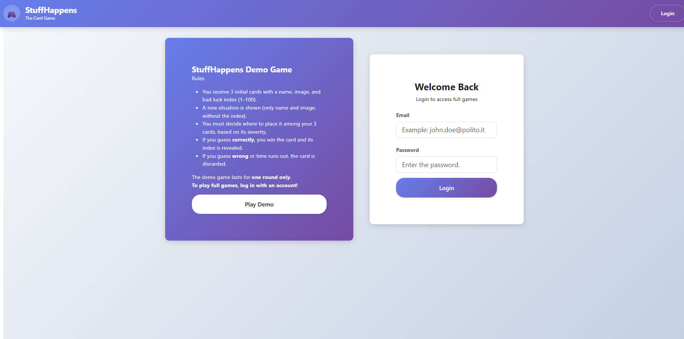
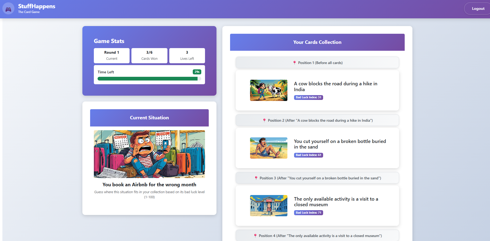
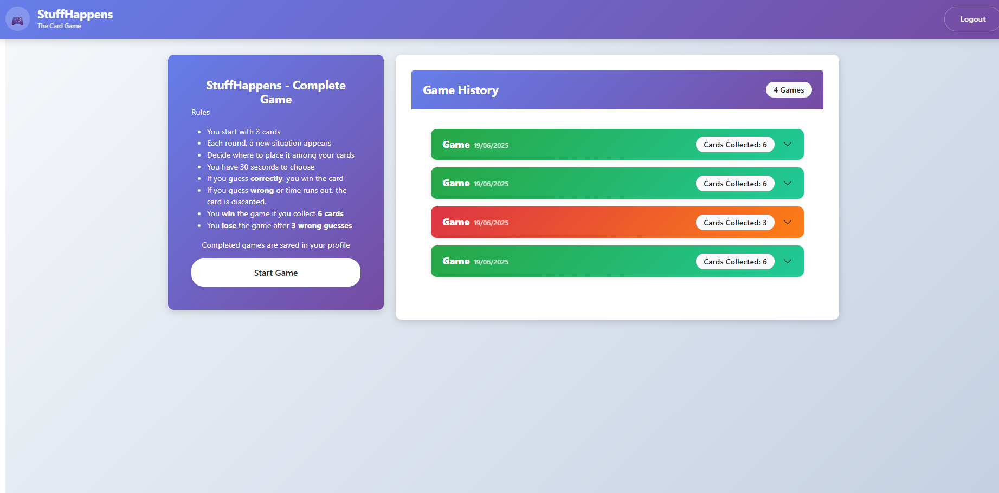

## React Client Application Routes

- Route `/`: Profile page showing user game history and option to start a new game. If not authenticated redirects to login
- Route `/login`: Authentication page with login form and demo game  option for anonymous users.
- Route `/game`: Complete game interface for authenticated users.
- Route `/demogame`: Demo game interface for anonymous users.

## API Server

### Authentication APIs

- POST `/api/sessions`
  - request body: credentials of the user who is trying to login
  - response: `200 OK` (success)
  - response body: authenticated user
  - error responses:  `500 Internal Server Error` (generic error), `401 Unauthorized User` (login failed)

- GET `/api/sessions/current`
  - request parameters: none
  - response: `200 OK` (success)
  - response body: current authenticated user 
  - error responses: `401 Unauthorized ` (user not authenticated)

- DELETE `/api/sessions/current`
  - request parameters: none
  - response: `200 OK` (success)
  - response body: none
  - error responses: none

### Game APIs

- POST `/api/game/start`
  - request body: empty
  - response: `200 OK` (success)
  - response body: object with initialCards and gameStaus
  - error responses:  `500 Internal Server Error` (generic error)

- POST `/api/game/nextround`
  - request body: empty
  - response: `200 OK` (success)
  - response body: object with roundCard, round number, and remaining attempts
  - error responses:`500 Internal Server Error` (generic error)

- POST `/api/game/answer`
  - request body: cardId and selectedPosition
  - response: `200 OK` (success)
  - response body: object with gameStatus, roundResult and updated playerCards array
  - error responses: `500 Internal Server Error` (generic error)

- GET `/api/game/history`
  - request parameters: none
  - response: `200 OK` (success)
  - response body: array of game objects with rounds, card details, and game outcomes
  - error responses: `401 Unauthorized ` (user not authenticated),`500 Internal Server Error` (generic error)

## Database Tables

- Table `users` - contains user authentication data: id (primary key), name (user's full name), email (unique login identifier), hash (encrypted password), salt (password encryption salt)
- Table `cards` - contains horrible situation cards: id (primary key), name (situation description), imagePath (image file reference), badLuckIndex
- Table `games` - contains completed game records: id (primary key), userId (foreign key to users table), status (game outcome: 'won' or 'lost'), startedAt (game start timestamp), ownedCards (final number of cards collected by player)
- Table `game_cards` - contains round history for each game: id (primary key), gameId (foreign key to games table), cardId (foreign key to cards table), roundNumber (round sequence in game, 0 for initial cards), won (boolean indicating if card was correctly guessed)

## Main React Components

- `App` (in `App.jsx`): main application component handling routing, authentication state management, and global feedback context with toast notifications
- `Header` (in `Header.jsx`): navigation header component displaying the game logo, title, and login/logout buttons based on authentication status
- `Auth` (in `Auth.jsx`): authentication page component with login form and demo game for anonymous users
- `Game` (in `Game.jsx`): game interface component managing complete game logic, timer, card positioning, round results, and game summary modals
- `OwnedCard` (in `OwnedCard.jsx`): reusable card component for displaying card details with conditional styling for different states

## Screenshot
### Login Interface

### Game Interface

### Profile Interface

## Users Credentials

- stefano@polito.it, stefanopassword 
- paoloni@polito.it, paolonipassword
